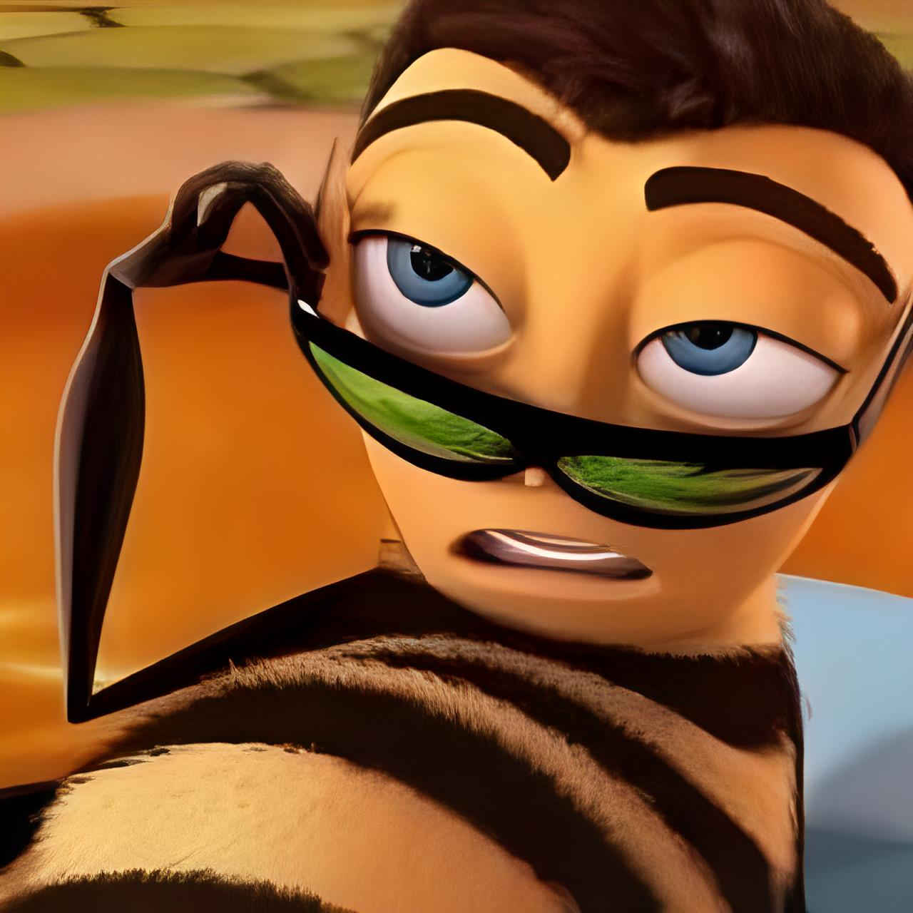

# PicBoost: High-Resolution Telegram Bot

[](https://www.python.org/downloads/)
[](https://github.com/ai-forever/Real-ESRGAN)
[](https://docs.python.org/3/library/asyncio.html)
[](https://onnxruntime.ai/)
[](https://aiogram.dev/)

## Описание проекта

Этот проект представляет собой Telegram-бота, разработанного для **улучшения качества фотографий**. Бот использует модель машинного обучения **Real-ESRGAN** (Real-world Super-Resolution Generative Adversarial Network) для увеличения разрешения и улучшения детализации изображений, делая их более четкими и качественными.

Код проекта High-Resolution Telegram Bot предоставляет вам два варианта использования. Для быстрого улучшения фотографий вы можете запустить готового бота [PicBoost](https://t.me/pic_boost_bot) прямо из Google Colab – это простой и бесплатный способ начать работу. Или же, вы можете использовать код High-Resolution Telegram Bot как основу для разработки собственных Telegram-ботов, создавая уникальные проекты с новым функционалом, опираясь на пример улучшения изображений.


**Основные возможности бота:**

*   **Улучшение качества фотографий:** Бот принимает фотографии от пользователей и применяет к ним модель Real-ESRGAN для увеличения разрешения и детализации.
*   **Поддержка различных масштабов увеличения:**  В проект интегрированы модели Real-ESRGAN, обученные для увеличения разрешения в 2, 4 и 8 раз (x2, x4, x8). Пользователь получает улучшенное изображение с повышенным разрешением и детализацией.
*   **Автоматический выбор устройства (CPU/GPU):** Бот автоматически определяет, доступен ли GPU (графический процессор) для ускорения обработки изображений. Если GPU доступен, он используется для инференса, в противном случае используется CPU. **Это позволяет боту эффективно работать на различных конфигурациях оборудования.**
*   **Поддержка различных форматов изображений:** Бот поддерживает распространенные форматы изображений, такие как JPG, PNG, JPEG, BMP и WEBP. Пользователи могут отправлять изображения в удобном для них формате.
*   **Асинхронная работа:** Бот разработан как асинхронное приложение, что обеспечивает отзывчивость и эффективность при обработке запросов от пользователей, даже во время выполнения ресурсоемких задач, таких как инференс модели. **Благодаря асинхронности, бот не "зависает" во время обработки изображений и быстро отвечает на команды пользователей.**
*   **Docker-контейнеризация:** Проект упакован в Docker контейнер, что упрощает развертывание и обеспечивает воспроизводимость работы бота в различных окружениях. **Docker позволяет легко запустить бота на любой системе, где установлен Docker, без необходимости настраивать окружение вручную.**
*   **Юнит-тестирование:** Проект включает набор юнит-тестов для проверки корректности работы модели и кода инференса. **Юнит-тестирование гарантирует стабильность работы основной функциональности бота и облегчает внесение изменений в код в будущем.**
*   **Линтинг кода:** В проекте настроен линтер `flake8` для поддержания качества и стиля кода. **Линтинг помогает поддерживать чистоту и читаемость кода, а также выявлять потенциальные ошибки.**

## Структура проекта

Проект имеет следующую структуру директорий и файлов:
```Markdown
high-resolution-bot/
├── bot/
│ ├── init.py
│ ├── main.py # Главный файл для запуска бота
│ ├── handlers.py # Файл с обработчиками команд и сообщений бота
│ ├── config.py # Файл конфигурации бота (токен, пути, настройки)
│ ├── utils.py # Файл с утилитарными функциями (скачивание, обработка изображений)
├── model/
│ ├── init.py
│ ├── versions/ # Директория для ONNX версий моделей
│ │ ├── RealESRGAN_x2.onnx
│ │ ├── RealESRGAN_x4.onnx
│ │ ├── RealESRGAN_x8.onnx
│ ├── inference.py # Файл для загрузки и запуска ONNX моделей (инференс)
│ ├── export/ # Папка для скриптов экспорта моделей из PyTorch в ONNX
│ │ ├── RealESRGAN/
│ │ ├── weights/ # Директория с весами моделей PyTorch (.pth)
│ │ │ ├── RealESRGAN_x2.pth
│ │ │ ├── RealESRGAN_x4.pth
│ │ │ ├── RealESRGAN_x8.pth
│ │ ├── onnx_export.py # Скрипт для экспорта моделей PyTorch в ONNX
├── tests/
│ ├── init.py
│ ├── test_model/
│ │ ├── test_model.py # Файл с тестами для модели
│ │ ├── test_data/ # Директория с тестовыми данными (входные/выходные изображения)
│ │ │ ├── input/
│ │ │ └── output/
├── Dockerfile # Файл Dockerfile для сборки Docker образа бота
├── .dockerignore # Файл .dockerignore для исключения файлов из Docker образа
├── .flake8 # Файл конфигурации flake8 для линтинга кода
├── README.md # Этот файл с описанием проекта
└── requirements.txt # Файл со списком Python зависимостей проекта
```

**Описание основных файлов и папок:**

*   **`bot/`**:
    *   **`config.py`**: Содержит все настройки бота, такие как токен Telegram бота (`BOT_TOKEN`), пути к моделям (локальные пути или пути внутри Docker контейнера), уровень логирования и имя файла для логов, а также флаг дебаг режима. **Файл `config.py` позволяет централизованно управлять конфигурацией бота, облегчая настройку и развертывание.** В итоговую версию репозитория этот файл не был загружен, поэтому для использования бота его нужно будет написать самостоятельно (шаблон будет дан дальше).
    *   **`main.py`**: Главный исполняемый файл, точка входа для запуска Telegram бота. Инициализирует бота (`aiogram.Bot`), диспетчер (`aiogram.Dispatcher`), настраивает логирование, загружает ONNX модель с помощью `model.inference.load_onnx_model`, передает сессию модели в диспетчер для доступа в обработчиках, регистрирует роутер с обработчиками из `handlers.py` и запускает процесс поллинга для приема и обработки входящих обновлений от Telegram. **`main.py` является сердцем приложения, связывая все компоненты бота и обеспечивая его запуск.** Бот реализован как **асинхронное приложение** с использованием библиотек `aiogram` и `asyncio`, что обеспечивает эффективную и неблокирующую обработку запросов.
    *   **`handlers.py`**: Содержит обработчики для различных типов сообщений и команд, получаемых от пользователей Telegram. Определяет логику работы бота:
        *   `start_command`: Обработчик команды `/start`, отправляет приветственное сообщение пользователю.
        *   `help_command`: Обработчик команды `/help`, отправляет справочное сообщение с инструкциями по использованию бота.
        *   `process_image_message`: **Ключевой обработчик** для обработки изображений, отправленных пользователем в виде фото или документа. Скачивает изображение, вызывает функцию `utils.process_image` для улучшения качества, и отправляет улучшенное изображение обратно пользователю. **Обработчик также отвечает за проверку размера файла и отправку изображения как фото или документа в зависимости от лимитов Telegram.**
        *   `unknown_message`: Обработчик для всех остальных текстовых сообщений, которые не распознаны как команды, сообщает пользователю о неизвестной команде.
        **Все обработчики являются асинхронными (`async def`) для обеспечения отзывчивости бота и неблокирующей обработки запросов.**
    *   **`utils.py`**: Содержит набор утилитарных функций, используемых в боте для выполнения общих задач:
        *   `process_image`: Функция для обработки изображения с использованием ONNX модели. Вызывает `model.inference.predict_onnx` для выполнения инференса, сохраняет улучшенное изображение во временный файл и возвращает путь к нему.
        *   `cleanup_file`: Функция для удаления файла по указанному пути, используется для очистки временных файлов.
        *   `download_photo`: Асинхронная функция для скачивания фотографии из Telegram с использованием `aiogram.Bot` и `aiohttp`. Возвращает путь к скачанному временному файлу.
        *   `download_document`: Асинхронная функция для скачивания документа из Telegram с использованием `aiogram.Bot`. Возвращает путь к скачанному файлу.
        **Многие функции в `utils.py`, особенно связанные с I/O операциями (сеть, файлы, инференс), также являются асинхронными (`async def`) для предотвращения блокировки основного потока бота.**

*   **`model/`**:
    *   **`versions/`**: Директория, содержащая ONNX версии моделей RealESRGAN, готовые к использованию для инференса. **Модели в формате ONNX обеспечивают кросс-платформенность и оптимизированы для быстрого инференса с использованием ONNX Runtime, что важно для производительности бота.** В директории представлены ONNX модели для масштабов увеличения x2, x4 и x8.
    *   **`inference.py`**: Файл, отвечающий за загрузку ONNX моделей и выполнение инференса (предсказания) для улучшения качества изображений.
        *   `load_onnx_model`: Функция для загрузки ONNX модели с использованием `onnxruntime.InferenceSession`. **Функция автоматически выбирает провайдера выполнения ONNX Runtime (GPU, если доступен, иначе CPU) для обеспечения оптимальной производительности на различных аппаратных конфигурациях.**
        *   `predict_onnx`: Асинхронная функция для выполнения инференса ONNX модели на изображении. **Функция использует `asyncio.loop.run_in_executor` для запуска синхронного кода инференса в отдельном потоке, чтобы не блокировать основной event loop бота и обеспечить отзывчивость.**
    *   **`export/`**: Директория, содержащая скрипты и ресурсы, необходимые для экспорта моделей RealESRGAN из формата PyTorch в формат ONNX. **Экспорт моделей в ONNX формат позволяет использовать высокопроизводительную среду выполнения ONNX Runtime для инференса в боте, а также обеспечивает переносимость моделей.**
        *   **`export/RealESRGAN/`**: Содержит код модели RealESRGAN, взятый из репозитория: [ai-forever/Real-ESRGAN](https://github.com/ai-forever/Real-ESRGAN). Включает в себя определение класса модели `RealESRGAN` на PyTorch (`RealESRGAN.py`).
        *   **`export/RealESRGAN/weights/`**: Содержит файлы весов моделей RealESRGAN в формате PyTorch (`.pth` файлы) для различных масштабов увеличения (x2, x4, x8). **Веса моделей RealESRGAN были взяты из Google Диска разработчиков использованной в проекте модели: [RealESRGAN_weights](https://drive.google.com/drive/folders/16PlVKhTNkSyWFx52RPb2hXPIQveNGbxS).** Использование предобученных весов позволило сосредоточиться на разработке функциональности бота и интеграции модели.
        *   **`export/onnx_export.py`**: Скрипт Python для автоматизации процесса экспорта моделей RealESRGAN из PyTorch в ONNX формат. Скрипт перебирает файлы весов в директории `weights/`, определяет масштаб увеличения и вызывает функцию `export_model_to_onnx` для экспорта каждой модели с динамическими осями для поддержки изображений различных размеров.

*   **`tests/`**:
    *   **`test_model/`**: Содержит юнит-тесты для проверки корректности работы модели и кода инференса. **Юнит-тесты играют важную роль в обеспечении надежности и стабильности проекта, позволяя автоматически проверять ключевую функциональность после внесения изменений в код.**
        *   **`test_model/test_model.py`**: Файл с тестовыми функциями, использующими фреймворк `pytest` для автоматического тестирования. **Тесты проверяют основной сценарий использования модели: загрузку, обработку изображений различных форматов и сохранение результатов. Фикстуры `inference_session`, `input_dir` и `output_dir` используются для организации тестового окружения и переиспользования ресурсов.**
        *   **`test_model/test_data/`**: Содержит тестовые данные, необходимые для запуска юнит-тестов. Включает поддиректории `input/` с входными изображениями различных форматов и `output/` с результатами работы модели. **Наличие тестовых данных позволяет воспроизводимо запускать тесты и убедиться в корректности работы модели на различных примерах.**

*   **`Dockerfile`**: Файл, описывающий шаги для сборки Docker образа приложения. **Docker используется для контейнеризации приложения, что обеспечивает воспроизводимость, портативность и упрощает развертывание бота в различных окружениях, от локальной машины разработчика до облачных платформ.** Dockerfile содержит инструкции для установки Python, зависимостей из `requirements.txt`, копирования кода проекта и настройки точки входа для запуска бота.
*   **`.dockerignore`**: Файл, указывающий, какие файлы и папки следует исключить из Docker образа при сборке. **Файл `.dockerignore` оптимизирует процесс сборки Docker образа, исключая ненужные файлы (например, `__pycache__`, временные файлы), что уменьшает размер образа и ускоряет сборку.**
*   **`.flake8`**: Файл конфигурации для инструмента `flake8`, используемого для линтинга кода Python (проверки на соответствие стилю и потенциальные ошибки). **Файл `.flake8` содержит настройки линтера, такие как максимальная длина строки, игнорируемые ошибки и исключаемые директории. Линтинг кода помогает поддерживать качество, читаемость и консистентность кода проекта.**
*   **`requirements.txt`**: Файл, содержащий список всех Python-библиотек и их версий, необходимых для запуска проекта. **Файл `requirements.txt` обеспечивает воспроизводимость окружения разработки и развертывания. Он позволяет легко установить все необходимые зависимости проекта с помощью команды `pip install -r requirements.txt`, что упрощает настройку проекта для новых разработчиков и в различных окружениях.**

## Как работает бот

Работа бота по улучшению качества фотографий реализуется следующим образом:

1.  **Пользователь отправляет боту фотографию или документ с изображением.**
2.  **`handlers.py` (обработчик `process_image_message`) получает обновление от Telegram.**
3.  **Обработчик определяет тип сообщения (фото или документ) и скачивает файл изображения**, используя функции из `utils.py` (`download_photo` или `download_document`). Временный файл изображения сохраняется локально.
4.  **Бот отправляет пользователю сообщение "Получил твое изображение, начинаю улучшать качество..."**
5.  **Обработчик вызывает функцию `process_image` из `utils.py` для улучшения качества изображения.**
6.  **`process_image` загружает ONNX модель (один раз при запуске бота) через `inference.load_onnx_model` из `model/inference.py`.**
7.  **`process_image` вызывает `inference.predict_onnx` из `model/inference.py`, передавая путь к скачанному изображению и сессию ONNX модели.**
8.  **`predict_onnx` выполняет инференс модели RealESRGAN на изображении (увеличение разрешения и улучшение детализации). Инференс может выполняться на GPU (если доступен и настроен) или на CPU.**
9.  **`process_image` получает улучшенное изображение в формате PIL Image.**
10. **`process_image` сохраняет улучшенное изображение во временный файл и возвращает путь к этому файлу.**
11. **`handlers.py` получает путь к улучшенному изображению.**
12. **Бот проверяет размер улучшенного файла.** Если размер файла превышает лимит Telegram для фото (10MB), бот отправляет улучшенное изображение как документ, иначе — как фото.
13. **Бот отправляет пользователю улучшенное изображение (фото или документ) с сообщением "Вот улучшенная версия!".**
14. **`handlers.py` вызывает `cleanup_file` из `utils.py` для удаления временных файлов (как исходного, так и улучшенного изображения).**
15. **Обработчики `start_command` и `help_command` в `handlers.py` обрабатывают команды `/start` и `/help`, отправляя пользователю приветственное и справочное сообщения соответственно.**
16. **Обработчик `unknown_message` в `handlers.py` обрабатывает неизвестные команды, сообщая пользователю, что команда не распознана.**

## Запуск бота

### Локальный запуск для разработки и тестирования

1.  **Клонируйте репозиторий проекта:**

    ```bash
    git clone https://github.com/Artemzakar/high-res-telegram-bot.git
    cd high-resolution-bot
    ```

2.  **Создайте и активируйте виртуальное окружение (рекомендуется):**

    ```bash
    python -m venv venv
    source venv/bin/activate  # Linux/macOS
    venv\Scripts\activate     # Windows
    ```

3.  **Установите зависимости проекта:**

    ```bash
    pip install -r requirements.txt
    ```

4.  **Настройте бота:**

    *   **Создайте файл конфигурации `bot/config.py`.**  Для этого, в директории `high-resolution-bot/bot/` создайте новый файл с именем `config.py` и скопируйте в него следующий шаблон, **обязательно заменив `"YOUR_BOT_TOKEN"` на реальный токен вашего Telegram бота**, полученный от BotFather.

        ```python
        import os

        # *** Основные настройки бота ***
        BOT_TOKEN = "YOUR_BOT_TOKEN"  # <-- **ОБЯЗАТЕЛЬНО ЗАМЕНИТЕ НА ТОКЕН ВАШЕГО БОТА!**

        # *** Настройки логирования ***
        LOG_LEVEL = "INFO"
        LOG_FILE = "bot.log"

        # *** Пути к директориям ***
        BASE_DIR = os.path.dirname(os.path.abspath(__file__))
        MODEL_DIR = os.path.join(BASE_DIR, '..', 'model')
        MODEL_VERSIONS_DIR = os.path.join(MODEL_DIR, 'versions')

        # *** Настройки моделей ***
        ACTIVE_MODEL_FILENAME = "RealESRGAN_x4.onnx"  # Имя файла активной модели
        ACTIVE_MODEL_PATH = os.path.join(MODEL_VERSIONS_DIR, ACTIVE_MODEL_FILENAME)
        ```

        **Описание параметров в файле `config.py`:**

        *   **`BOT_TOKEN`**: **(Обязательно к заполнению)** Токен вашего Telegram бота, полученный от BotFather. Бот будет использовать этот токен для аутентификации и работы с Telegram API. **Без корректного токена бот не сможет запуститься.**
        *   **`LOG_LEVEL`**: Уровень логирования. Определяет, какие сообщения будут записываться в лог-файл. Возможные значения: `"DEBUG"`, `"INFO"`, `"WARNING"`, `"ERROR"`, `"CRITICAL"`. `"INFO"` является рекомендуемым уровнем для обычной работы, `"DEBUG"` полезен для отладки.
        *   **`LOG_FILE`**: Имя файла для записи логов. Лог-файл будет создан в той же директории, откуда запускается бот.
        *   **`ACTIVE_MODEL_FILENAME`**: Имя файла активной ONNX модели, которая будет использоваться для улучшения качества изображений. По умолчанию `"RealESRGAN_x4.onnx"`. Вы можете изменить на `"RealESRGAN_x2.onnx"` или `"RealESRGAN_x8.onnx"` для использования моделей с другим масштабом увеличения.
        *   Остальные перменные участвуют только в создании пути к папке с версиями моделей и их менять не стоит.
        

5.  **Запустите бота:**

    ```bash
    python -m bot.main
    ```

    Бот запустится и начнет ожидать входящие сообщения в Telegram.

## Развертывание Telegram-бота PicBoost в Google Colab

В качестве альтернативы развертыванию на сервере, проект предусматривает возможность запуска бота в среде **Google Colab**.  Этот способ позволяет ознакомиться с работой бота, используя бесплатные вычислительные ресурсы Google Colab.

Для запуска бота в Google Colab, используйте **Notebook `PicBoost.ipynb`**, который находится в репозитории проекта. Откройте этот Notebook в Google Colab и выполните следующие действия:

**В Notebook `PicBoost.ipynb` запустите единственную ячейку с кодом, содержащую команды:**

```
    !pip install udocker
    !udocker --allow-root install
    !udocker --allow-root run artemzakar/high-res-telegram-bot:v3
```

**Подробное описание команд:**

1.  **`!pip install udocker`**:

    *   Эта команда использует `pip`, стандартный менеджер пакетов Python, для **установки `udocker`**.
    *   `udocker` – это **легковесная утилита командной строки, которая позволяет запускать Docker контейнеры в средах без привилегий суперпользователя (root)**.
    *   В Google Colab, как и во многих других облачных средах, пользователи не имеют root-доступа к системе.
    *   `udocker` обходит это ограничение, предоставляя возможность запускать Docker контейнеры без root-прав, что **является необходимым условием для запуска нашего Docker-контейнеризированного бота в Google Colab**.

2.  **`!udocker --allow-root install`**:

    *   После установки `udocker` с помощью `pip`, эта команда выполняет **установку самой утилиты `udocker` в окружение Google Colab**.
    *   Опция `--allow-root` **специфична для Google Colab и подобных сред**. В обычных условиях использование `--allow-root` не рекомендуется из соображений безопасности.
    *   Однако, в Google Colab, из-за особенностей среды и ограничений безопасности, `--allow-root` **необходим для корректной установки `udocker`**.
    *   Эта команда подготавливает окружение Colab для дальнейшего запуска Docker контейнеров с помощью `udocker`.

3.  **`!udocker --allow-root run artemzakar/high-res-telegram-bot:v3`**:

    *   Это **ключевая команда для запуска бота**. Она использует установленную утилиту `udocker` для **запуска Docker контейнера**.
        *   `run`:  Подкоманда `udocker run` указывает на действие запуска контейнера.
        *   `--allow-root`:  Как и в предыдущей команде, опция `--allow-root` используется **из-за ограничений Google Colab**. Она позволяет `udocker` корректно работать в среде Colab.
        *   `artemzakar/high-res-telegram-bot:v3`:  Это **имя Docker образа**, который необходимо запустить.
    
**Важная информация о запуске в Google Colab:**
После выполнения команды `!udocker --allow-root run ...`, подождите 3-4 минуты. В течение этого времени Google Colab будет загружать Docker образ бота с Docker Hub. Не прерывайте выполнение команды во время загрузки.

После завершения загрузки и запуска контейнера, Google Colab отобразит сообщение `STARTING`. Бот будет готов к работе и начнет отвечать на сообщения в Telegram только после появления сообщения `STARTING`. До этого момента бот может быть временно недоступен.

## Использование бота

Если вы хотите воспользоваться уже готовым ботом PicBoost, вам не нужно создавать своего бота или вставлять какой-либо код, то просто откройте [PicBoost в Telegram](https://t.me/pic_boost_bot). Если вы использовали код для создания своего Telegram-бота, то после запуска бота, найдите его в Telegram по имени пользователя, которое вы указали при создании бота через BotFather.

**Инструкции по использованию:**

1.  **Начните диалог с ботом, отправив команду `/start`.** Бот поприветствует вас.
2.  **Для получения справки по использованию бота, отправьте команду `/help`.** Бот пришлет вам инструкции и информацию о поддерживаемых форматах.
3.  **Отправьте боту фотографию, которую хотите улучшить.** Вы можете отправить фотографию как **фотографию** или как **документ**.
4.  **Бот обработает ваше изображение и пришлет вам улучшенную версию.** Подождите некоторое время, пока бот обрабатывает изображение. Время обработки зависит от размера изображения и доступных ресурсов (CPU/GPU).

## О модели

В основе бота для улучшения качества фотографий лежит модель **Real-ESRGAN** (Real-world Super-Resolution Generative Adversarial Network). Изначально, в рамках проекта планировалось использовать **официальную реализацию модели Real-ESRGAN**, представленную в репозитории [xinntao/Real-ESRGAN](https://github.com/xinntao/Real-ESRGAN).

Однако, в процессе интеграции официальной модели в проект возникли **технические сложности**.  В частности, интеграция и экспорт модели в формат ONNX для эффективного инференса в боте оказались более трудоемкими, чем ожидалось, в рамках ограниченного времени и ресурсов проекта.

В связи с этим, было принято решение использовать **альтернативную реализацию модели Real-ESRGAN**, доступную в репозитории [ai-forever/Real-ESRGAN](https://github.com/ai-forever/Real-ESRGAN).

**Ключевые отличия и преимущества выбранной модели от `ai-forever/Real-ESRGAN`:**

*   **Улучшенная работа с лицами:** Модель от `ai-forever` была обучена на **специализированном датасете**, что, по заявлению авторов, обеспечивает **лучшие результаты при улучшении качества изображений лиц** по сравнению с оригинальной моделью.  Это может быть важным преимуществом для пользователей, улучшающих портретные фотографии.
*   **Упрощенная интеграция:**  Альтернативная реализация оказалась **более простой в интеграции в проект и экспорте в формат ONNX**.  Это позволило **ускорить процесс разработки бота и сосредоточиться на других аспектах проекта**, таких как асинхронная работа, Docker-контейнеризация и юнит-тестирование.
*   **Предобученные веса:**  Авторы `ai-forever/Real-ESRGAN` предоставили **готовые веса моделей**, доступные для скачивания, в том числе через [Google Drive](https://drive.google.com/drive/folders/16PlVKhTNkSyWFx52RPb2hXPIQveNGbxS).  **Веса моделей Real-ESRGAN, используемые в данном проекте, были взяты именно из этого Google Drive**, предоставленного создателями модели. В боте [PicBoost](https://t.me/pic_boost_bot) используется модель x4 (увеличивает разрешение изображения в 4 раза).

**Отказ от самостоятельного обучения модели:**

В рамках данного проекта **не проводилось обучение модели с нуля или дообучение существующих моделей**.  Решение использовать **предобученные веса** было принято из-за **ограниченности вычислительных ресурсов и времени, доступных для проекта**.  Обучение моделей супер-разрешения, таких как Real-ESRGAN, требует значительных вычислительных мощностей и времени.  Использование готовых весов позволило **сосредоточиться на разработке и отладке функциональности бота, а также на интеграции и адаптации существующей модели для эффективной работы в Telegram-боте**.

## Тестирование

Проект включает юнит-тесты для проверки корректности работы модели и кода инференса. Тесты находятся в директории `tests/test_model/`.

Для запуска тестов установите `pytest`:

```bash
pip install pytest
```
И запустите тесты из корневой директории проекта:
```bash
pytest tests/test_model/
```

## Результаты работы бота

Для наглядного сравнения, ниже представлены 5 пар входных и выходных изображений, расположенных side-by-side.  Все изображения имеют **фиксированную ширину** для удобства сравнения.

| Входное изображение (Input)                                                                     | Выходное изображение (Output)                                                                      |
|-------------------------------------------------------------------------------------------------|----------------------------------------------------------------------------------------------------|
|  |  |
|  |  |
|  |  |
|  |  |
|  |  |            | **Описание выходного изображения:**  Улучшенный JPEG после обработки моделью. |

## Запись демо

Вы можете посмотреть короткую видео-демонстрацию, чтобы увидеть основные функции бота и познакомиться с его интерфейсом:
[Демонстрация работы Telegram-бота PicBoost](https://youtu.be/o3LqMD2T5x8?si=fqtBdByFbkQ0L9To)

## Линтинг кода

Для поддержания качества кода и соответствия стандартам стиля, в проекте настроен линтер `flake8`. Конфигурация линтера находится в файле `.flake8` в корне проекта.

**Для проверки кода с помощью flake8:**

1.  **Установите `flake8`:**

    ```bash
    pip install flake8
    ```

2.  **Запустите линтинг из корневой директории проекта:**

    ```bash
    flake8 .
    ```

    `flake8` проанализирует код проекта и выведет список предупреждений и ошибок стиля, если они есть.

## Дополнительные фичи

*   **Асинхронная архитектура бота:** Бот разработан как **асинхронное приложение** с использованием библиотек `aiogram` и `asyncio`.  **Асинхронность обеспечивает высокую отзывчивость и эффективность бота**, позволяя ему быстро обрабатывать запросы пользователей, даже во время выполнения ресурсоемких задач, таких как инференс модели.  Благодаря асинхронной модели, бот не "зависает" при обработке изображений и остается доступным для новых запросов, обеспечивая комфортный пользовательский опыт. **Реализация бота как асинхронного приложения является важной дополнительной фичей, повышающей его производительность и масштабируемость.**
*   **Универсальное улучшение качества фотографий:** Бот способен **улучшать качество фотографий различных типов и жанров**.  В отличие от моделей, обученных для узкоспециализированных задач, **модель Real-ESRGAN, используемая в боте, является моделью общего назначения для улучшения качества изображений реального мира**.  Это означает, что бот эффективно обрабатывает и улучшает детализацию и разрешение **широкого спектра фотографий**, включая портреты, пейзажи, городские снимки, фотографии документов и многое другое, делая его **универсальным инструментом для улучшения визуального качества изображений**.

## Ограничения и проблемы

*   **Интеграция с моделью Real-ESRGAN (официальный репозиторий):**  В процессе разработки возникли технические сложности с интеграцией модели Real-ESRGAN непосредственно из официального репозитория [xinntao/Real-ESRGAN](https://github.com/xinntao/Real-ESRGAN).  В связи с этим, для реализации бота была использована альтернативная, более адаптированная версия модели из репозитория [ai-forever/Real-ESRGAN](https://github.com/ai-forever/Real-ESRGAN).  Хотя альтернативная модель обеспечивает хорошее качество улучшения изображений, важно понимать, что это не прямая интеграция с оригинальной реализацией Real-ESRGAN.

*   **Возможная работа на CPU в Google Colab:** При запуске бота в среде Google Colab с использованием Docker, инференс модели может выполняться на CPU, даже при наличии доступного GPU. Это связано с потенциальной несовместимостью версий CUDA, NVIDIA драйверов и библиотеки `onnxruntime-gpu` в окружении Colab, которые невозможно полностью контролировать.  В результате, **в Google Colab производительность бота может быть ниже**, чем при запуске на локальном компьютере или сервере с настроенным GPU.

*   **Время обработки изображений:**  Бот достаточно быстро обрабатывает изображения небольшого размера (обычно в течение минуты). Однако, **обработка фотографий с высоким разрешением и большим размером файла может занять значительно больше времени, вплоть до 5 минут и дольше.**  Время обработки зависит от размера изображения, сложности сцены и доступных вычислительных ресурсов.  Пожалуйста, учитывайте это при отправке боту больших изображений и ожидайте завершения обработки.

## Контакты

Для вопросов, предложений или обратной связи свяжитесь с разработчиком: [artem.zakar@gmail.com](https://mail.google.com/mail/u/0/#inbox?compose=jrjtWvPRXBcLTZWTDWFSxGtJZFmZfJbmZPxDQjFLBlTKLQVFxxwVwQXTwsnjlpRjhWlLcLCR)
